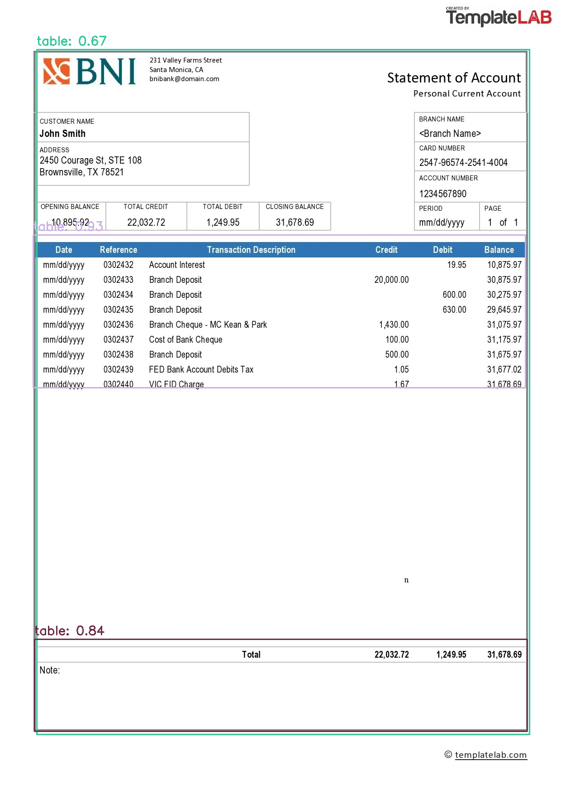

# Object Detection in Images Using Transformers

## Description
This project is a back-end application developed in Python for object detection in images using transformer models. 
The application offers a RESTful API for submitting images and obtaining detection results,with error handling and input validation features.
The project also includes pytest to ensure the code quality.

## Features

- Object detection in images using transformer models
- RESTful API to submit images and get detection results
- Error handling and input validation
- Pytests to ensure code quality

## Project Files
- requirement.txt: This file lists the Python dependencies needed for the project.
- Dockerfile : This file defines the Docker environment for the application.
- app.py : This is the main application file.
- test_with_pytest : This is the file containing the tests for the application.
- Tabeldetector.py : This is the file containing the TableDetector class to detect object in Bank doc images via API.

## The user guide 
This user guide for installing, runing, and testing the object detection application using Docker
- cmd for installing and building our customed docker image : docker build -t appimage .
- cmd for runing the docker image : docker run appimage 
- cmds for app testing : 
  - docker run -it appimage /bin/bash
  - python test_with_pytest.py

## Results

### input image 

### output image 

#### using this cmds for Building ,runninig and testing 
##### build the image => docker build -t appimage .
##### run the app => docker run appimage
### teminal output  

#### using this cmds
##### for having hands on the docker image terminal => docker run -it appimage /bin/bash
##### run the test => python test_with_pytest.py
### terminal pytest output

### terminal output (case of not existing image file)
- in the case of none detecting object, we use test.jpg image as input

- if you face HTTP error 503: Service Unavailable - 503 Server Error: Service Unavailable for url: https://api-inference.huggingface.co/models/TahaDouaji/detr-doc-table-detection ,try again 
